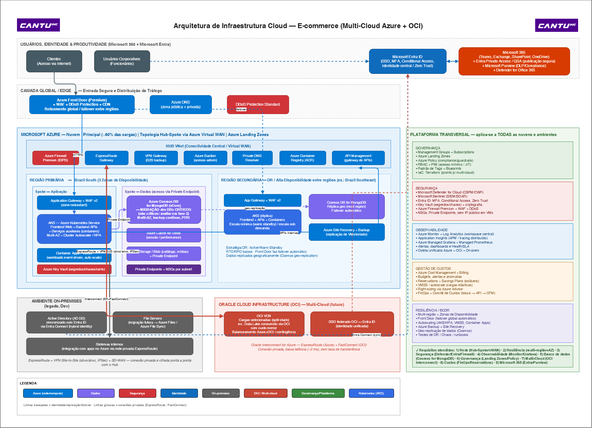

# Arquitetura de Infraestrutura Cloud — E-commerce (Multi-Cloud Azure + OCI)

Resposta à **Prova Técnica de Analista InfraCloud**. Este repositório contém o desenho de uma arquitetura de infraestrutura cloud para uma plataforma de e-commerce, sustentando o ambiente atual (Azure + on-premises) e habilitando a evolução para um cenário **multi-cloud com a Oracle Cloud Infrastructure (OCI)**.

---

## Contexto

A plataforma de e-commerce responde por mais de 80% da receita da empresa, portanto **disponibilidade e resiliência são críticas**. Cerca de 80% da infraestrutura já está no **Microsoft Azure**, ainda há serviços **on-premises** (Active Directory, File Servers e sistemas internos) e existe um movimento estratégico para **multi-cloud com OCI**. A colaboração corporativa usa **Microsoft 365**, com identidade centralizada no **Microsoft Entra**.

**Princípios balizadores:** Azure first · Hub-Spoke · Zero Trust · IaC (Terraform) · FinOps · observabilidade unificada entre nuvens.

---

## Estrutura do repositório

| Arquivo | Descrição |
|---|---|
| 'arquitetura-infracloud.drawio' | Diagrama editável (importável no draw.io / diagrams.net) |
| 'arquitetura-infracloud.png' | Exportação do diagrama em imagem |
| 'arquitetura-infracloud.md' | Descrição técnica detalhada da arquitetura |
| 'README.md' | Este arquivo (visão geral e índice) |

---

## Como visualizar / editar o diagrama

1. Acesse [app.diagrams.net](https://app.diagrams.net) (draw.io).
2. Menu **File → Open From → Device** e selecione 'arquitetura-infracloud.drawio'.
3. O diagrama abre editável; para uma visão rápida, basta abrir o 'arquitetura-infracloud.png'.

---

## Resumo da solução (pontos obrigatórios)

| # | Requisito | Abordagem principal |
|---|---|---|
| 1 | **Arquitetura de Rede** | Hub-Spoke sobre Azure Virtual WAN; Azure Firewall Premium, ExpressRoute + VPN S2S (ativo/ativo, IPSec); NSGs e Private Endpoints |
| 2 | **Resiliência** | Multi-região + Zonas de Disponibilidade; Front Door com failover global; autoscaling (AKS/HPA, VMSS); Backup + Site Recovery |
| 3 | **Segurança** | Entra ID (MFA/Conditional Access/Zero Trust), Defender for Cloud, Sentinel (SIEM/SOAR), Firewall Premium + WAF + DDoS, Key Vault |
| 4 | **Observabilidade** | Azure Monitor + Log Analytics, Application Insights, Managed Grafana + Prometheus; coleta unificada Azure + OCI + on-prem |
| 5 | **Banco de Dados** | Migração do MongoDB em VMs para Azure Cosmos DB for MongoDB (vCore); geo-replicação para DR |
| 6 | **Governança** | Management Groups, Azure Landing Zones, Azure Policy, RBAC + PIM, Tags/Blueprints, IaC Terraform |
| 7 | **Multi-Cloud (OCI)** | Oracle Interconnect for Azure (ExpressRoute + FastConnect); SSO federado OCI ↔ Entra; balanceamento Azure×OCI |
| 8 | **Gestão de Custos** | Cost Management + Billing, Reservations/Savings Plans, VMSS, right-sizing, FinOps + Comitê de Custos |
| 9 | **Microsoft 365** | Integração via Entra ID (SSO/Conditional Access), Entra Private Access/GSA, Purview e Defender for Office 365 |

> Detalhamento completo de cada ponto em [`arquitetura-infracloud.md`](arquitetura-infracloud.md).

---

## Escopo e premissas

As recomendações priorizam ações de **curto e médio prazo**, deixando indicadas as evoluções de longo prazo (especialmente em FinOps, que dependem de maior conhecimento do dia a dia da empresa). A maturidade do ambiente é tratada por fases, com avanços condicionados ao atendimento de KPIs.

---

## Autor

*(Cristiano Pureza · Analista Senior InfraEstrutura Cloud/On-Premises · (51)99774-5197 / https://linkedin.com/in/cristianopureza)*
